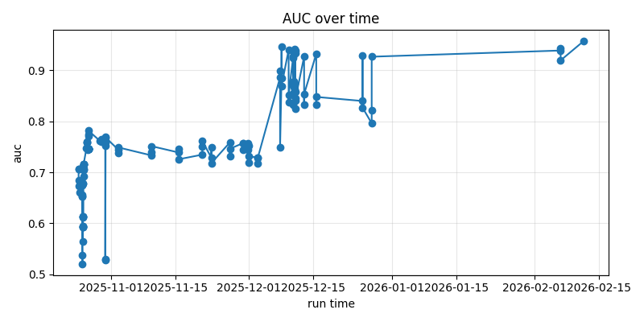
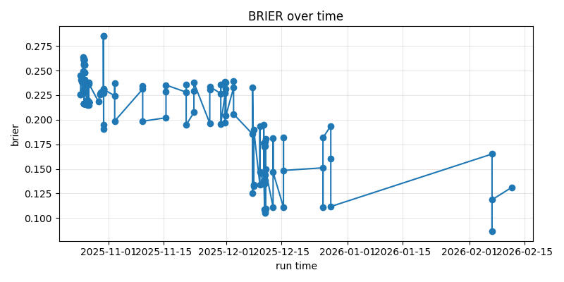
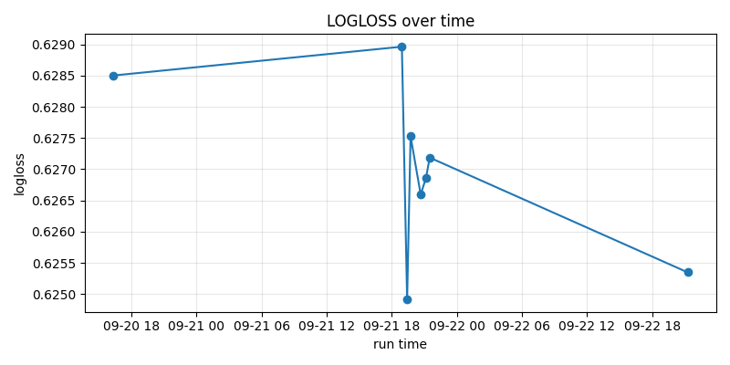

# Run Comparison Report
Generated: 2026-02-11 16:50:25 UTC

## Run Leaderboard
 run_id    model_name                       created_at      auc    brier
run_148 unknown_model 2026-02-11 16:50:24.264607+00:00 0.956813 0.131151
run_145 unknown_model 2026-02-06 17:21:13.695287+00:00 0.919257 0.118692
run_147 unknown_model 2026-02-06 17:21:13.695287+00:00 0.943222 0.086733
run_146 unknown_model 2026-02-06 17:21:13.695287+00:00 0.938543 0.165166
run_142 unknown_model 2025-12-27 15:43:13.588107+00:00 0.926418 0.111782
run_144 unknown_model 2025-12-27 15:43:13.588107+00:00 0.820723 0.160619
run_143 unknown_model 2025-12-27 15:43:13.588107+00:00 0.796034 0.193777
run_141 unknown_model 2025-12-25 15:53:43.827167+00:00 0.839621 0.151143
run_139 unknown_model 2025-12-25 15:53:43.827167+00:00 0.929168 0.111100
run_140 unknown_model 2025-12-25 15:53:43.827167+00:00 0.826641 0.181688

## Metric Leaders
### AUC leaders
 run_id    model_name                       created_at      auc
run_148 unknown_model 2026-02-11 16:50:24.264607+00:00 0.956813
run_109 unknown_model 2025-12-08 01:22:37.720952+00:00 0.946371
run_147 unknown_model 2026-02-06 17:21:13.695287+00:00 0.943222
run_124 unknown_model 2025-12-10 20:50:31.621072+00:00 0.940835
run_112 unknown_model 2025-12-09 14:27:49.755454+00:00 0.940248

### Brier leaders
 run_id    model_name                       created_at    brier
run_147 unknown_model 2026-02-06 17:21:13.695287+00:00 0.086733
run_124 unknown_model 2025-12-10 20:50:31.621072+00:00 0.105417
run_127 unknown_model 2025-12-11 00:02:43.259783+00:00 0.107006
run_121 unknown_model 2025-12-10 19:13:08.542957+00:00 0.108984
run_130 unknown_model 2025-12-11 00:32:46.772612+00:00 0.109602

## Highlights
Best run so far: **unknown_model (run_148)** on 2026-02-11. AUC=0.957, Brier=0.131, LogLoss=NA, Accuracy=NA, n=NA.
It edges the previous leader (unknown_model / run_109) by +0.010 AUC and +0.001 Brier.

## Metric Trends

