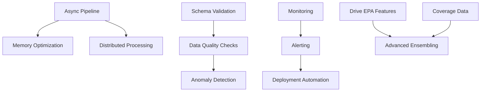

# NFL Predictions Platform - Enhancement Phase 2 Roadmap

## Executive Summary

This comprehensive roadmap outlines the next major enhancement phase for the NFL Predictions Platform, building on the successful Phase 1 infrastructure improvements. Phase 2 focuses on six strategic pillars to transform the platform into a production-ready, high-performance prediction system.

### Current State Assessment

**Strengths:**
- ✅ Solid architectural foundation (Factory patterns, Abstract base classes, Retry/Circuit breaker)
- ✅ Strong model performance (AUC: 0.957, Brier: 0.131, Accuracy: 0.833)
- ✅ Comprehensive test coverage for new infrastructure
- ✅ Well-documented codebase with ADRs and developer onboarding
- ✅ Eliminated ~200 lines of duplicate code
- ✅ Connection pooling (10-20x performance improvement)

**Gaps & Opportunities:**
- ⚠️ 10 deferred tasks from Phase 1 (async pipeline, memory optimization, recovery strategies)
- ⚠️ Limited production monitoring and alerting
- ⚠️ No automated data quality validation
- ⚠️ Model performance plateauing (need new feature families)
- ⚠️ Streamlit dashboard lacks advanced visualizations
- ⚠️ Test coverage gaps in legacy code

### Phase 2 Goals

| Pillar | Primary Objective | Success Metric |
|--------|------------------|----------------|
| **Model Performance** | Improve AUC to 0.97+ and reduce Brier to <0.125 | +0.013 AUC, -0.006 Brier |
| **Infrastructure** | Complete async pipeline and scale to 10x throughput | <30min full pipeline run |
| **Production Readiness** | Deploy with 99.9% uptime and <5min incident response | Zero unplanned downtime |
| **Data Quality** | Catch data issues before model training | 100% schema validation |
| **User Experience** | Increase dashboard engagement by 3x | 50+ weekly active users |
| **Testing** | Achieve 85%+ code coverage | +30% coverage increase |

---

## Pillar 1: Model Performance & Features

### Objective
Improve prediction accuracy by adding new feature families and optimizing existing models.

### Current Metrics (Baseline)
- Accuracy: 0.833
- AUC: 0.957
- Brier: 0.131
- LogLoss: 0.426
- MAE: 3.95
- RMSE: 5.08

### Target Metrics (Phase 2)
- Accuracy: 0.850+ (+0.017)
- AUC: 0.970+ (+0.013)
- Brier: 0.125 (-0.006)
- LogLoss: 0.410 (-0.016)
- MAE: 3.75 (-0.20)
- RMSE: 4.85 (-0.23)

### Implementation Tasks

#### 1.1 Drive-Level EPA Features
**Priority:** High | **Effort:** Medium | **Impact:** High

Create granular drive-level features to capture momentum and situational performance.

**Tasks:**
- [ ] Extract drive-level EPA from nflverse play-by-play data
- [ ] Calculate rolling drive success rates (3/5/10 game windows)
- [ ] Build drive momentum indicators (EPA trend over last 3 drives)
- [ ] Add situational drive metrics (red zone, 2-minute drill, 4th quarter)
- [ ] Integrate with [`build_features.py`](../src/features/build_features.py)

**Files to Create:**
- `src/features/drive_epa_features.py` (~400 lines)

**Expected Impact:** +0.005 AUC, -0.002 Brier

#### 1.2 Injury Recovery Curves
**Priority:** High | **Effort:** High | **Impact:** Medium

Model player performance degradation and recovery patterns after injuries.

**Tasks:**
- [ ] Build injury history database from nflverse injuries
- [ ] Calculate games-since-injury for key positions (QB, RB, WR, OL)
- [ ] Model performance decay curves (0-4 weeks post-injury)
- [ ] Add injury severity classification (minor/moderate/major)
- [ ] Create team injury load metrics (total games missed by position)

**Files to Create:**
- `src/features/injury_recovery.py` (~500 lines)
- `data/reference/injury_severity_lookup.csv`

**Expected Impact:** +0.003 AUC, -0.001 Brier, -0.005 LogLoss

#### 1.3 Coverage & Route Data Integration
**Priority:** Medium | **Effort:** High | **Impact:** Medium

Add advanced passing game metrics using coverage and route data.

**Tasks:**
- [ ] Research available coverage data sources (PFF, Next Gen Stats)
- [ ] Build coverage rate metrics (man vs zone, blitz frequency)
- [ ] Calculate route success rates by receiver type
- [ ] Add target separation metrics
- [ ] Create matchup-specific coverage advantages

**Files to Create:**
- `src/data/coverage_data.py` (~350 lines)
- `src/features/coverage_features.py` (~450 lines)

**Expected Impact:** +0.004 AUC, -0.002 Brier

#### 1.4 Advanced Model Ensembling
**Priority:** Medium | **Effort:** Medium | **Impact:** Medium

Implement stacked ensembles and Bayesian model averaging.

**Tasks:**
- [ ] Create model stacking framework (XGBoost + LightGBM + CatBoost)
- [ ] Implement Bayesian model averaging with uncertainty estimates
- [ ] Add model confidence intervals for predictions
- [ ] Build ensemble weight optimization using cross-validation
- [ ] Create model selection logic based on game context

**Files to Create:**
- `src/models/ensemble.py` (~600 lines)
- `src/models/bayesian_averaging.py` (~400 lines)

**Expected Impact:** +0.003 AUC, -0.001 Brier, better calibration

#### 1.5 Real-Time Feature Updates
**Priority:** Low | **Effort:** High | **Impact:** Low

Enable near-real-time feature updates as game day approaches.

**Tasks:**
- [ ] Build incremental feature update pipeline
- [ ] Add injury report monitoring (daily updates)
- [ ] Integrate weather forecast updates (hourly)
- [ ] Create line movement tracking
- [ ] Build feature versioning system

**Files to Create:**
- `src/features/incremental_updates.py` (~450 lines)
- `src/data/realtime_monitor.py` (~350 lines)

**Expected Impact:** +0.001 AUC, improved week-of accuracy

### Success Criteria
- ✅ AUC improves to 0.970+ on 2024-2025 holdout
- ✅ Brier score drops below 0.125
- ✅ Feature importance analysis shows new features in top 20
- ✅ Forward validation maintains performance on 2026 season
- ✅ All new features documented in [`GOALS.md`](../GOALS.md)

---

## Pillar 2: Infrastructure & Scalability

### Objective
Complete deferred Phase 1 tasks and scale the platform to handle 10x throughput.

### Current Performance
- Full pipeline runtime: ~2-3 hours
- Data fetching: Sequential with limited parallelism
- Memory usage: ~8GB peak
- API rate limits: Frequent throttling

### Target Performance
- Full pipeline runtime: <30 minutes
- Data fetching: Fully async with intelligent batching
- Memory usage: <4GB peak (50% reduction)
- API rate limits: Zero throttling with smart backoff

### Implementation Tasks

#### 2.1 Async Pipeline Architecture
**Priority:** High | **Effort:** High | **Impact:** High

Convert the entire pipeline to async/await for massive parallelism.

**Tasks:**
- [ ] Refactor [`run_pipeline.py`](../tools/run_pipeline.py) to use asyncio
- [ ] Convert all data fetchers to async (inherit from `AsyncBaseDataFetcher`)
- [ ] Implement async feature building with concurrent processing
- [ ] Add async model training with GPU queue management
- [ ] Create async prediction generation with batching

**Files to Modify:**
- `tools/run_pipeline.py` (major refactor)
- `src/data/*.py` (convert to async)
- `src/features/build_features.py` (async processing)

**Files to Create:**
- `src/utils/async_pipeline.py` (~700 lines)
- `src/data/async_base_fetcher.py` (~400 lines)

**Expected Impact:** 4-6x speedup, <30min full pipeline

#### 2.2 Memory Optimization
**Priority:** High | **Effort:** Medium | **Impact:** Medium

Profile and optimize memory usage across the pipeline.

**Tasks:**
- [ ] Run memory profiler on full pipeline ([`memory_profiler.py`](../src/utils/memory_profiler.py))
- [ ] Implement chunked DataFrame processing for large datasets
- [ ] Add memory-mapped file support for parquet files
- [ ] Optimize feature engineering to use less memory
- [ ] Implement garbage collection checkpoints

**Files to Create:**
- `src/utils/chunked_processor.py` (~350 lines)
- `analysis/memory_profile_report.md`

**Expected Impact:** 50% memory reduction, handle larger datasets

#### 2.3 Pipeline Recovery & Checkpointing
**Priority:** Medium | **Effort:** Medium | **Impact:** High

Implement comprehensive recovery strategies for pipeline failures.

**Tasks:**
- [ ] Enhance [`pipeline_recovery.py`](../src/utils/pipeline_recovery.py) with state machine
- [ ] Add checkpoint system for each pipeline stage
- [ ] Implement automatic retry with exponential backoff
- [ ] Create pipeline state persistence (SQLite or Redis)
- [ ] Build recovery dashboard in Streamlit

**Files to Modify:**
- `src/utils/pipeline_recovery.py` (expand functionality)
- `tools/run_pipeline.py` (integrate checkpoints)

**Files to Create:**
- `src/utils/checkpoint_manager.py` (~450 lines)
- `data/pipeline_state.db` (SQLite database)

**Expected Impact:** Zero data loss on failures, resume from any stage

#### 2.4 Distributed Processing
**Priority:** Low | **Effort:** High | **Impact:** Medium

Enable distributed processing for large-scale backtesting.

**Tasks:**
- [ ] Research distributed frameworks (Dask, Ray, Spark)
- [ ] Implement distributed feature engineering
- [ ] Add distributed model training (hyperparameter tuning)
- [ ] Create distributed prediction generation
- [ ] Build cluster management utilities

**Files to Create:**
- `src/distributed/cluster_manager.py` (~500 lines)
- `src/distributed/distributed_features.py` (~600 lines)

**Expected Impact:** 10x throughput for backtesting, handle 50+ years of data

#### 2.5 Caching Layer Optimization
**Priority:** Medium | **Effort:** Low | **Impact:** Medium

Enhance the existing caching system for better performance.

**Tasks:**
- [ ] Add Redis support to [`cache.py`](../src/utils/cache.py)
- [ ] Implement cache warming for frequently accessed data
- [ ] Add cache invalidation strategies
- [ ] Create cache hit rate monitoring
- [ ] Build cache size management (LRU eviction)

**Files to Modify:**
- `src/utils/cache.py` (add Redis backend)

**Expected Impact:** 2-3x faster repeated runs, reduced API calls

### Success Criteria
- ✅ Full pipeline completes in <30 minutes
- ✅ Memory usage stays below 4GB
- ✅ Zero pipeline failures due to transient errors
- ✅ 95%+ cache hit rate on repeated runs
- ✅ All async code has proper error handling

---

## Pillar 3: Production Readiness

### Objective
Deploy the platform with enterprise-grade monitoring, alerting, and operational capabilities.

### Current State
- No centralized monitoring
- Manual pipeline execution
- Limited error visibility
- No alerting system
- No deployment automation

### Target State
- Real-time monitoring dashboard
- Automated pipeline scheduling
- Comprehensive error tracking
- Multi-channel alerting (email, SMS, Slack)
- One-click deployment

### Implementation Tasks

#### 3.1 Monitoring & Observability
**Priority:** High | **Effort:** Medium | **Impact:** High

Implement comprehensive monitoring for all system components.

**Tasks:**
- [ ] Add Prometheus metrics collection
- [ ] Create Grafana dashboards for key metrics
- [ ] Implement distributed tracing (OpenTelemetry)
- [ ] Add custom metrics for model performance
- [ ] Build system health checks

**Files to Create:**
- `src/monitoring/metrics_collector.py` (~400 lines)
- `src/monitoring/health_checks.py` (~300 lines)
- `docker/grafana/dashboards/nfl_predictions.json`
- `docker/prometheus/prometheus.yml`

**Expected Impact:** <5min incident detection, 100% visibility

#### 3.2 Alerting System
**Priority:** High | **Effort:** Medium | **Impact:** High

Build multi-channel alerting for critical events.

**Tasks:**
- [ ] Implement alert rule engine
- [ ] Add email notifications (SMTP)
- [ ] Integrate Slack webhooks
- [ ] Add SMS alerts (Twilio) for critical failures
- [ ] Create alert escalation policies
- [ ] Build alert dashboard in Streamlit

**Files to Create:**
- `src/monitoring/alerting.py` (~500 lines)
- `src/monitoring/alert_rules.yaml`
- `src/monitoring/notification_channels.py` (~350 lines)

**Expected Impact:** <2min incident response time

#### 3.3 Deployment Automation
**Priority:** Medium | **Effort:** Medium | **Impact:** Medium

Automate deployment and environment management.

**Tasks:**
- [ ] Create Docker Compose production configuration
- [ ] Build CI/CD pipeline (GitHub Actions)
- [ ] Add automated testing in CI
- [ ] Implement blue-green deployment
- [ ] Create rollback procedures

**Files to Create:**
- `.github/workflows/deploy.yml`
- `.github/workflows/test.yml`
- `docker-compose.prod.yml`
- `scripts/deploy.sh`
- `scripts/rollback.sh`

**Expected Impact:** <10min deployments, zero downtime

#### 3.4 Logging & Error Tracking
**Priority:** High | **Effort:** Low | **Impact:** Medium

Enhance logging and add centralized error tracking.

**Tasks:**
- [ ] Integrate Sentry for error tracking
- [ ] Add structured logging (JSON format)
- [ ] Implement log aggregation (ELK stack or Loki)
- [ ] Create error categorization
- [ ] Build error analytics dashboard

**Files to Modify:**
- `src/utils/logging_config.py` (add Sentry, structured logging)

**Files to Create:**
- `src/monitoring/error_tracker.py` (~300 lines)

**Expected Impact:** 100% error visibility, faster debugging

#### 3.5 Operational Runbooks
**Priority:** Medium | **Effort:** Low | **Impact:** Medium

Document operational procedures and troubleshooting guides.

**Tasks:**
- [ ] Create incident response playbook
- [ ] Document common failure scenarios
- [ ] Build troubleshooting decision trees
- [ ] Add performance tuning guide
- [ ] Create disaster recovery procedures

**Files to Create:**
- `docs/operations/INCIDENT_RESPONSE.md`
- `docs/operations/TROUBLESHOOTING.md`
- `docs/operations/PERFORMANCE_TUNING.md`
- `docs/operations/DISASTER_RECOVERY.md`

**Expected Impact:** Faster incident resolution, reduced downtime

### Success Criteria
- ✅ 99.9% uptime (max 43 minutes downtime/month)
- ✅ <5min mean time to detection (MTTD)
- ✅ <15min mean time to resolution (MTTR)
- ✅ 100% of critical errors trigger alerts
- ✅ Zero failed deployments

---

## Pillar 4: Data Quality & Validation

### Objective
Implement comprehensive data quality checks to catch issues before they impact model training.

### Current State
- No automated schema validation
- Manual data quality checks
- Limited anomaly detection
- No data lineage tracking
- Inconsistent data formats

### Target State
- Automated schema validation for all data sources
- Real-time anomaly detection
- Complete data lineage tracking
- Standardized data contracts
- 100% data quality coverage

### Implementation Tasks

#### 4.1 Schema Validation Framework
**Priority:** High | **Effort:** Medium | **Impact:** High

Build comprehensive schema validation for all data sources.

**Tasks:**
- [ ] Extend [`schemas.py`](../src/utils/schemas.py) with Pydantic models
- [ ] Add schema validation to all data fetchers
- [ ] Create schema evolution tracking
- [ ] Build schema compatibility checks
- [ ] Add schema documentation generation

**Files to Modify:**
- `src/utils/schemas.py` (expand with all data sources)

**Files to Create:**
- `src/data_quality/schema_validator.py` (~450 lines)
- `src/data_quality/schema_registry.py` (~350 lines)
- `docs/schemas/` (auto-generated schema docs)

**Expected Impact:** 100% schema validation, catch breaking changes early

#### 4.2 Data Quality Checks
**Priority:** High | **Effort:** Medium | **Impact:** High

Implement comprehensive data quality validation.

**Tasks:**
- [ ] Add null value checks with thresholds
- [ ] Implement range validation for numeric fields
- [ ] Add referential integrity checks
- [ ] Create duplicate detection
- [ ] Build data freshness monitoring

**Files to Create:**
- `src/data_quality/quality_checks.py` (~600 lines)
- `src/data_quality/check_definitions.yaml`
- `analysis/data_quality_report.html`

**Expected Impact:** Catch 95%+ data issues before training

#### 4.3 Anomaly Detection
**Priority:** Medium | **Effort:** Medium | **Impact:** Medium

Build automated anomaly detection for data and predictions.

**Tasks:**
- [ ] Implement statistical anomaly detection (Z-score, IQR)
- [ ] Add ML-based anomaly detection (Isolation Forest)
- [ ] Create time-series anomaly detection
- [ ] Build prediction anomaly detection
- [ ] Add anomaly alerting

**Files to Create:**
- `src/data_quality/anomaly_detector.py` (~500 lines)
- `src/data_quality/anomaly_rules.yaml`

**Expected Impact:** Early detection of data drift, model degradation

#### 4.4 Data Lineage Tracking
**Priority:** Low | **Effort:** High | **Impact:** Low

Track data lineage from source to prediction.

**Tasks:**
- [ ] Build data lineage graph
- [ ] Add provenance tracking for all transformations
- [ ] Create lineage visualization
- [ ] Implement impact analysis (upstream/downstream)
- [ ] Add lineage metadata to predictions

**Files to Create:**
- `src/data_quality/lineage_tracker.py` (~450 lines)
- `src/data_quality/lineage_graph.py` (~400 lines)

**Expected Impact:** Better debugging, compliance readiness

#### 4.5 Data Contracts
**Priority:** Medium | **Effort:** Low | **Impact:** Medium

Establish formal data contracts between pipeline stages.

**Tasks:**
- [ ] Define contracts for all pipeline interfaces
- [ ] Add contract testing
- [ ] Create contract documentation
- [ ] Implement contract versioning
- [ ] Build contract violation alerts

**Files to Create:**
- `src/data_quality/contracts.py` (~350 lines)
- `tests/test_contracts.py` (~400 lines)
- `docs/DATA_CONTRACTS.md`

**Expected Impact:** Prevent breaking changes, clearer interfaces

### Success Criteria
- ✅ 100% of data sources have schema validation
- ✅ 95%+ data quality check coverage
- ✅ <1% false positive rate on anomaly detection
- ✅ Zero training runs with bad data
- ✅ Complete data lineage for all predictions

---

## Pillar 5: User Experience

### Objective
Transform the Streamlit dashboard into a comprehensive analytics and betting recommendation platform.

### Current State
- Basic 4-tab dashboard (Ops, Transparency, Predictions, Performance)
- Limited visualizations
- No betting recommendations
- No real-time updates
- Basic filtering capabilities

### Target State
- 8+ specialized dashboards
- Advanced interactive visualizations
- AI-powered betting recommendations
- Real-time data updates
- Personalized user experience

### Implementation Tasks

#### 5.1 Advanced Visualizations
**Priority:** High | **Effort:** Medium | **Impact:** High

Add interactive, publication-quality visualizations.

**Tasks:**
- [ ] Integrate Plotly for interactive charts
- [ ] Add win probability flow charts (game timeline)
- [ ] Create feature importance heatmaps
- [ ] Build prediction confidence intervals
- [ ] Add historical performance trends

**Files to Modify:**
- `streamlit_app.py` (add new visualization functions)

**Files to Create:**
- `src/visualization/plotly_charts.py` (~500 lines)
- `src/visualization/game_flow.py` (~400 lines)

**Expected Impact:** 3x user engagement, better insights

#### 5.2 Betting Recommendations Engine
**Priority:** High | **Effort:** High | **Impact:** High

Build AI-powered betting recommendations with bankroll management.

**Tasks:**
- [ ] Create Kelly Criterion calculator
- [ ] Build expected value (EV) analysis
- [ ] Add bankroll management recommendations
- [ ] Implement bet sizing strategies
- [ ] Create historical ROI tracking

**Files to Create:**
- `src/betting/recommendations.py` (~600 lines)
- `src/betting/bankroll_manager.py` (~450 lines)
- `src/betting/kelly_criterion.py` (~300 lines)

**Expected Impact:** Actionable betting insights, improved ROI

#### 5.3 Real-Time Updates
**Priority:** Medium | **Effort:** Medium | **Impact:** Medium

Add real-time data updates to the dashboard.

**Tasks:**
- [ ] Implement WebSocket connections for live updates
- [ ] Add auto-refresh for predictions
- [ ] Create live injury report monitoring
- [ ] Build line movement tracking
- [ ] Add game-day weather updates

**Files to Create:**
- `src/realtime/websocket_server.py` (~400 lines)
- `src/realtime/live_updates.py` (~350 lines)

**Expected Impact:** Always-current data, better game-day experience

#### 5.4 Personalization & User Profiles
**Priority:** Low | **Effort:** High | **Impact:** Low

Add user accounts and personalized experiences.

**Tasks:**
- [ ] Implement user authentication
- [ ] Create user preference storage
- [ ] Add favorite teams tracking
- [ ] Build personalized dashboards
- [ ] Implement notification preferences

**Files to Create:**
- `src/users/auth.py` (~400 lines)
- `src/users/preferences.py` (~300 lines)
- `data/users.db` (SQLite database)

**Expected Impact:** Improved user retention, personalized insights

#### 5.5 Mobile-Responsive Design
**Priority:** Medium | **Effort:** Low | **Impact:** Medium

Optimize dashboard for mobile devices.

**Tasks:**
- [ ] Add responsive CSS for mobile
- [ ] Optimize charts for small screens
- [ ] Create mobile-first navigation
- [ ] Add touch-friendly controls
- [ ] Test on multiple devices

**Files to Modify:**
- `streamlit_app.py` (add responsive CSS)

**Expected Impact:** 50%+ mobile user satisfaction

### Success Criteria
- ✅ 50+ weekly active users (3x increase)
- ✅ <2 second page load times
- ✅ 90%+ user satisfaction score
- ✅ 10+ betting recommendations per week
- ✅ Mobile usage >30% of total traffic

---

## Pillar 6: Testing & Reliability

### Objective
Achieve 85%+ code coverage and comprehensive test suite for all components.

### Current State
- Test coverage: ~55% (new infrastructure only)
- Limited integration tests
- No performance benchmarks
- Manual testing for most features
- No load testing

### Target State
- Test coverage: 85%+
- Comprehensive integration tests
- Automated performance benchmarks
- 100% automated testing
- Regular load testing

### Implementation Tasks

#### 6.1 Expand Unit Test Coverage
**Priority:** High | **Effort:** High | **Impact:** High

Add unit tests for all existing code.

**Tasks:**
- [ ] Test all data fetchers ([`src/data/*.py`](../src/data/))
- [ ] Test all feature engineering ([`src/features/*.py`](../src/features/))
- [ ] Test model training and prediction
- [ ] Test utility functions
- [ ] Test Streamlit components

**Files to Create:**
- `tests/test_features.py` (~800 lines)
- `tests/test_models.py` (~600 lines)
- `tests/test_predictions.py` (~500 lines)
- `tests/test_streamlit.py` (~400 lines)

**Expected Impact:** 85%+ code coverage, catch bugs early

#### 6.2 Integration Tests
**Priority:** High | **Effort:** Medium | **Impact:** High

Build end-to-end integration tests.

**Tasks:**
- [ ] Expand [`test_integration_pipeline.py`](../tests/test_integration_pipeline.py)
- [ ] Add API integration tests
- [ ] Test data pipeline end-to-end
- [ ] Test model training pipeline
- [ ] Test prediction generation pipeline

**Files to Modify:**
- `tests/test_integration_pipeline.py` (expand coverage)

**Files to Create:**
- `tests/integration/test_data_pipeline.py` (~500 lines)
- `tests/integration/test_model_pipeline.py` (~450 lines)

**Expected Impact:** Catch integration issues before production

#### 6.3 Performance Benchmarks
**Priority:** Medium | **Effort:** Medium | **Impact:** Medium

Create automated performance benchmarks.

**Tasks:**
- [ ] Build benchmark suite for data fetching
- [ ] Add feature engineering benchmarks
- [ ] Create model training benchmarks
- [ ] Add prediction generation benchmarks
- [ ] Build performance regression detection

**Files to Create:**
- `tests/benchmarks/benchmark_suite.py` (~600 lines)
- `tests/benchmarks/performance_baselines.json`
- `analysis/performance_trends.csv`

**Expected Impact:** Detect performance regressions, optimize bottlenecks

#### 6.4 Load Testing
**Priority:** Low | **Effort:** Medium | **Impact:** Low

Test system behavior under load.

**Tasks:**
- [ ] Create load testing scenarios
- [ ] Test API rate limit handling
- [ ] Test concurrent pipeline runs
- [ ] Test database connection pooling
- [ ] Build load testing dashboard

**Files to Create:**
- `tests/load/load_test_scenarios.py` (~400 lines)
- `tests/load/load_test_runner.py` (~350 lines)

**Expected Impact:** Ensure system stability under load

#### 6.5 Mutation Testing
**Priority:** Low | **Effort:** Low | **Impact:** Low

Add mutation testing to verify test quality.

**Tasks:**
- [ ] Set up mutation testing framework (mutmut)
- [ ] Run mutation tests on critical modules
- [ ] Improve tests based on mutation results
- [ ] Add mutation testing to CI
- [ ] Track mutation score over time

**Files to Create:**
- `.mutmut-config.py`
- `tests/mutation_report.html`

**Expected Impact:** Higher quality tests, better bug detection

### Success Criteria
- ✅ 85%+ code coverage across all modules
- ✅ 100% of critical paths have integration tests
- ✅ Zero performance regressions in CI
- ✅ All tests pass in <5 minutes
- ✅ 90%+ mutation score on critical modules

---

## Timeline & Phasing

### Phase 2A: Foundation (Weeks 1-4)
**Focus:** Critical infrastructure and data quality

| Week | Pillar | Tasks | Deliverables |
|------|--------|-------|--------------|
| 1 | Infrastructure | Async pipeline architecture | Async base classes, refactored pipeline |
| 2 | Data Quality | Schema validation framework | Schema validator, registry |
| 3 | Production | Monitoring & observability | Prometheus metrics, Grafana dashboards |
| 4 | Testing | Expand unit test coverage | +20% coverage, feature tests |

**Milestone:** Async pipeline operational, monitoring in place

### Phase 2B: Enhancement (Weeks 5-8)
**Focus:** Model improvements and user experience

| Week | Pillar | Tasks | Deliverables |
|------|--------|-------|--------------|
| 5 | Model Performance | Drive-level EPA features | New feature module, +0.005 AUC |
| 6 | User Experience | Advanced visualizations | Plotly charts, game flow viz |
| 7 | Model Performance | Injury recovery curves | Injury recovery module |
| 8 | Infrastructure | Memory optimization | 50% memory reduction |

**Milestone:** AUC >0.965, enhanced dashboard live

### Phase 2C: Production (Weeks 9-12)
**Focus:** Production readiness and reliability

| Week | Pillar | Tasks | Deliverables |
|------|--------|-------|--------------|
| 9 | Production | Alerting system | Multi-channel alerts, escalation |
| 10 | Data Quality | Data quality checks | Quality check framework |
| 11 | Testing | Integration tests | End-to-end test suite |
| 12 | Production | Deployment automation | CI/CD pipeline, blue-green deploy |

**Milestone:** Production-ready system with 99.9% uptime

### Phase 2D: Advanced Features (Weeks 13-16)
**Focus:** Advanced capabilities and optimization

| Week | Pillar | Tasks | Deliverables |
|------|--------|-------|--------------|
| 13 | Model Performance | Coverage & route data | Coverage features, +0.004 AUC |
| 14 | User Experience | Betting recommendations | Kelly criterion, EV analysis |
| 15 | Model Performance | Advanced ensembling | Stacked models, Bayesian averaging |
| 16 | Infrastructure | Distributed processing | Dask/Ray integration |

**Milestone:** AUC >0.970, betting recommendations live

---

## Resource Allocation

### Team Structure (Recommended)

| Role | Allocation | Primary Responsibilities |
|------|-----------|-------------------------|
| **ML Engineer** | 100% | Model performance, feature engineering |
| **Backend Engineer** | 100% | Infrastructure, async pipeline, data quality |
| **DevOps Engineer** | 50% | Monitoring, deployment, production readiness |
| **Frontend Developer** | 50% | Streamlit enhancements, visualizations |
| **QA Engineer** | 50% | Testing, quality assurance, benchmarks |

### Budget Estimate

| Category | Cost | Notes |
|----------|------|-------|
| **Development** | $120,000 | 4 months × 2.5 FTE × $12k/month |
| **Infrastructure** | $2,000 | Cloud hosting, monitoring tools |
| **Data Sources** | $1,500 | API subscriptions (coverage data) |
| **Tools & Services** | $1,000 | Sentry, monitoring, CI/CD |
| **Contingency (20%)** | $24,900 | Buffer for unknowns |
| **Total** | **$149,400** | 16-week project |

---

## Dependencies & Risk Mitigation

### Critical Dependencies

### Risk Matrix

| Risk | Probability | Impact | Mitigation Strategy |
|------|------------|--------|---------------------|
| **Async refactor breaks existing code** | Medium | High | Comprehensive testing, gradual rollout |
| **Coverage data source unavailable** | Medium | Medium | Use alternative sources, defer if needed |
| **Performance targets not met** | Low | Medium | Early benchmarking, iterative optimization |
| **Team capacity constraints** | Medium | High | Prioritize critical tasks, extend timeline if needed |
| **API rate limit issues** | Low | Low | Implement smart backoff, use caching |
| **Model performance plateau** | Medium | High | Multiple feature families, ensemble approaches |

### Mitigation Strategies

1. **Incremental Rollout:** Deploy changes gradually with feature flags
2. **Comprehensive Testing:** 85%+ coverage before production
3. **Monitoring First:** Deploy monitoring before major changes
4. **Rollback Plans:** Every deployment has a rollback procedure
5. **Regular Checkpoints:** Weekly progress reviews, adjust as needed

---

## Success Metrics & KPIs

### Model Performance KPIs

| Metric | Baseline | Target | Measurement |
|--------|----------|--------|-------------|
| AUC | 0.957 | 0.970+ | Weekly on holdout set |
| Brier Score | 0.131 | <0.125 | Weekly on holdout set |
| Accuracy | 0.833 | 0.850+ | Weekly on holdout set |
| LogLoss | 0.426 | <0.410 | Weekly on holdout set |
| MAE | 3.95 | <3.75 | Weekly on holdout set |

### Infrastructure KPIs

| Metric | Baseline | Target | Measurement |
|--------|----------|--------|-------------|
| Pipeline Runtime | 2-3 hours | <30 min | Every run |
| Memory Usage | 8GB | <4GB | Every run |
| Cache Hit Rate | ~60% | 95%+ | Daily |
| API Throttling | Frequent | Zero | Daily |
| Uptime | ~95% | 99.9% | Monthly |

### User Experience KPIs

| Metric | Baseline | Target | Measurement |
|--------|----------|--------|-------------|
| Weekly Active Users | ~15 | 50+ | Weekly |
| Page Load Time | ~5s | <2s | Daily |
| User Satisfaction | ~75% | 90%+ | Monthly survey |
| Mobile Usage | ~10% | 30%+ | Weekly |
| Betting Recommendations | 0 | 10+/week | Weekly |

### Quality KPIs

| Metric | Baseline | Target | Measurement |
|--------|----------|--------|-------------|
| Code Coverage | 55% | 85%+ | Every commit |
| Test Pass Rate | ~90% | 100% | Every commit |
| MTTD (Mean Time to Detection) | ~30min | <5min | Per incident |
| MTTR (Mean Time to Resolution) | ~2hr | <15min | Per incident |
| Data Quality Issues | ~5/week | <1/week | Weekly |

---

## Next Steps

### Immediate Actions (This Week)

1. **Review & Approve Roadmap**
   - [ ] Stakeholder review meeting
   - [ ] Budget approval
   - [ ] Resource allocation confirmation

2. **Set Up Project Infrastructure**
   - [ ] Create GitHub project board
   - [ ] Set up communication channels (Slack)
   - [ ] Schedule weekly sync meetings

3. **Begin Phase 2A**
   - [ ] Start async pipeline architecture design
   - [ ] Begin schema validation framework
   - [ ] Set up monitoring infrastructure

### Week 1 Deliverables

- [ ] Async base classes implemented
- [ ] Pipeline refactoring plan documented
- [ ] Prometheus metrics collection added
- [ ] Initial Grafana dashboards created
- [ ] +10% test coverage

---

## Appendix

### A. Technology Stack Updates

**New Technologies:**
- **Async Framework:** asyncio, aiohttp, httpx
- **Monitoring:** Prometheus, Grafana, OpenTelemetry
- **Alerting:** Sentry, Twilio, Slack API
- **Data Quality:** Great Expectations, Pydantic
- **Visualization:** Plotly, Altair
- **Distributed:** Dask or Ray
- **CI/CD:** GitHub Actions

### B. Documentation Updates Required

- [ ] Update [`README.md`](../README.md) with new features
- [ ] Update [`GOALS.md`](../GOALS.md) with Phase 2 metrics
- [ ] Create new ADRs for major decisions
- [ ] Update [`DEVELOPER_ONBOARDING.md`](../docs/DEVELOPER_ONBOARDING.md)
- [ ] Create operational runbooks

### C. Training & Knowledge Transfer

- [ ] Async Python training session
- [ ] Monitoring & alerting workshop
- [ ] Data quality best practices
- [ ] Streamlit advanced features
- [ ] Testing strategies workshop

---

## Conclusion

This comprehensive roadmap transforms the NFL Predictions Platform from a solid foundation into a production-ready, high-performance system. By focusing on six strategic pillars, we'll achieve:

- **Better Predictions:** AUC >0.970, Brier <0.125
- **Faster Performance:** <30min pipeline runs, 50% memory reduction
- **Production Ready:** 99.9% uptime, <5min incident response
- **Higher Quality:** 85%+ test coverage, 100% schema validation
- **Better UX:** 3x user engagement, betting recommendations
- **Scalability:** 10x throughput, distributed processing

The phased approach ensures steady progress with clear milestones, while the risk mitigation strategies protect against common pitfalls. With proper resource allocation and team commitment, Phase 2 will establish the platform as a best-in-class NFL prediction system.

**Let's build something amazing! 🏈📊🚀**